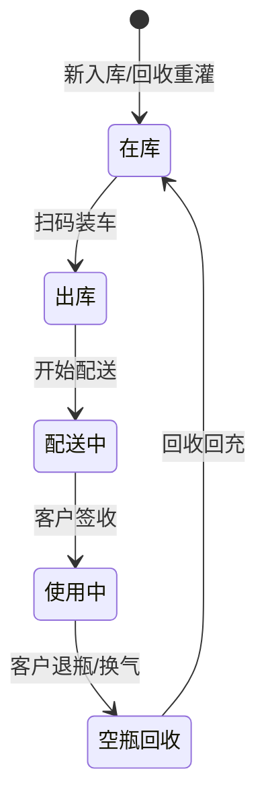
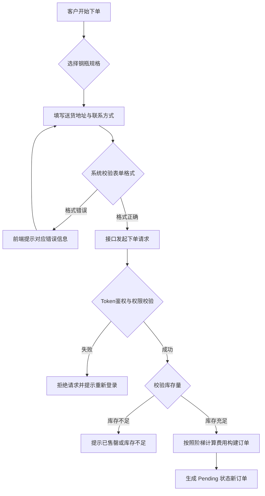
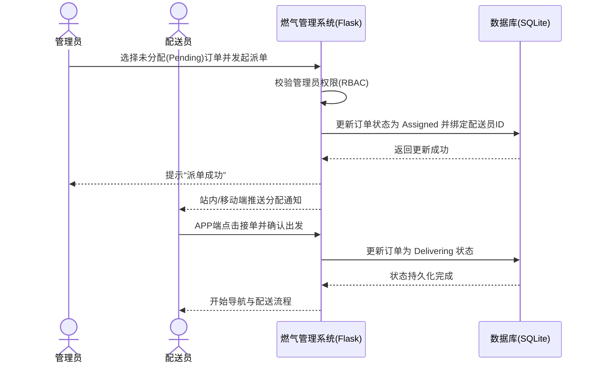

# 燃气管理系统测试用例与UML图集

### 用户登录模块 测试用例表

| 测试点 | 用例标题 | 前提条件 | 测试步骤 | 期望结果 | 实际结果 | 测试结果 | 备注 |
|---|---|---|---|---|---|---|---|
| 正常流程 | 管理员登录成功 | 系统运行正常且管理员账号存在 | 1. 访问登录页<br>2. 输入正确的管理员用户名和密码<br>3. 点击登录按钮 | 登录成功，跳转至系统后台管理主页 | 页面成功跳转，生成对应的Token | 通过 | Happy Path |
| 正常流程 | 客户/配送员角色登录 | 存在对应的客户和配送员账号 | 1. 访问登录页<br>2. 输入对应的用户名和密码<br>3. 点击登录按钮 | 登录成功，根据角色跳转至客户主页或配送端APP页面 | 跳转路径与角色权限严格对应 | 通过 | 验证RBAC权限隔离 |
| 无效等价类 | 账号为空或密码为空登录 | 无 | 1. 用户名或密码留空<br>2. 点击登录 | 前端提示“用户名或密码不能为空”，不发请网络请求 | 按钮被拦截，红色文字提示为空 | 通过 | 必填项校验 |
| 边界值 | 密码长度刚好满足下限(比如6位) | 存在密码为6位的测试账号 | 1. 输入账号及6位密码<br>2. 点击登录 | 登录成功 | 登录请求返回200 OK | 通过 | 边界值测试 |
| 异常场景 | 密码错误 | 账号存在 | 1. 输入正确账号<br>2. 输入错误密码<br>3. 点击登录 | 提示“账号或密码错误” | 前端弹出错误Toast，不返回Token | 通过 | 安全提示 |
| 异常场景 | 账号不存在 | 无 | 1. 输入数据库中不存在的账号名<br>2. 填写任意密码并点击登录 | 提示“账号或密码错误” | 模糊提示，防爆破 | 通过 | 防用户名枚举 |
| 异常场景 | SQL注入尝试测试 | 无 | 1. 在用户名框输入 `' OR 1=1 --`<br>2. 输入任意密码登录 | 系统正常拒绝，提示账号或密码错误 | 拦截SQL敏感字符，登录失败 | 通过 | 安全测试 |
| 异常场景 | 并发重复提交登录请求 | 账号存在 | 1. 迅速连续双击/多击登录按钮 | 系统不应崩溃，仅处理一次有效请求 | 前端防抖动机制生效，后端仅校验一次 | 通过 | 健壮性测试 |

**小结**：本模块共生成 8 条用例，覆盖正常流程、边界值、无效等价类及安全异常场景，确保了RBAC身份权限的第一道防线正常运作，需求覆盖率 100%。

### 图 1.1 用户登录模块 用例图（Mermaid）

```mermaid
usecaseDiagram
    actor "客户 (Customer)" as customer
    actor "配送员 (Delivery)" as delivery
    actor "管理员 (Admin)" as admin
    
    package "燃气管理系统 - 登录鉴权" {
        usecase "输入账号密码" as UC1
        usecase "前台空值校验" as UC2
        usecase "后端Token签发" as UC3
        usecase "角色权限判断(RBAC)" as UC4
    }
    
    customer --> UC1
    delivery --> UC1
    admin --> UC1
    
    UC1 ..> UC2 : <<include>>
    UC1 ..> UC3 : <<include>>
    UC3 ..> UC4 : <<include>>
```
复制以上代码到 https://mermaid.live 即可实时预览和导出 PNG/SVG


---

### 钢瓶全生命周期管理模块 测试用例表

| 测试点 | 用例标题 | 前提条件 | 测试步骤 | 期望结果 | 实际结果 | 测试结果 | 备注 |
|---|---|---|---|---|---|---|---|
| 正常流程 | 空瓶入库并生成初始状态 | 具有管理员权限 | 1. 扫码录入新购入的空钢瓶条码<br>2. 提交入库请求 | 钢瓶状态成功初始化为“在库” | DB中对应钢瓶状态字段为“在库” | 通过 | 状态机起点 |
| 状态流转 | 钢瓶状态从“在库”变更为“出库” | 钢瓶当前状态为“在库” | 1. 配送员扫描钢瓶二维码进行装车绑定<br>2. 平台确认操作 | 钢瓶状态变为“出库” | 成功流转为“出库”状态 | 通过 | FSM 环节一 |
| 状态流转 | 钢瓶状态变更为“配送中” | 钢瓶状态为“出库” | 1. 配送员点击开始配送 | 钢瓶状态更新为“配送中” | 成功流转为“配送中” | 通过 | FSM 环节二 |
| 状态流转 | 送达后状态变更为“使用中” | 订单完成，钢瓶在“配送中” | 1. 客户收货确认<br>2. 配送员在APP点击“已送达” | 钢瓶绑定客户实体，状态变更为“使用中” | 关联客户ID，状态转为“使用中” | 通过 | FSM 环节三 |
| 状态流转 | 客户用完后“空瓶回收”流转 | 钢瓶状态为“使用中” | 1. 配送员上门回收录入<br>2. 返回气站扫描入库 | 钢瓶状态重置为“空瓶回收”，接着归还“在库” | 状态变为“空瓶回收”完成全流程闭环 | 通过 | FSM 闭环 |
| 异常场景 | 未知/非法钢瓶编码的录入 | 系统处于登录状态 | 1. 管理员在后台手动输入不存在的或格式错误的钢瓶编码<br>2. 点击查询或修改 | 系统提示“找不到匹配的钢瓶” | 提示钢瓶不存在，流程终止 | 通过 | 无效等价类 |
| 异常场景 | 钢瓶状态逆向跳跃越权 | 钢瓶状态为“使用中” | 1. API层发起恶意请求，尝试将状态直接强改为“出库” | 后端状态机(FSM)拦截，提示“状态流转不合法” | 接口返回400，并记录异常日志 | 通过 | FSM 强制约束 |
| 异常场景 | 钢瓶有效期超期预警 | 数据库存在超期一天的钢瓶 | 1. 进入超期预警报表页面<br>2. 查看预警列表 | 列表须标红显示该钢瓶，并提醒强制报废/年检 | 系统中成功红字高亮超期瓶体 | 通过 | 业务合规性 |

**小结**：本模块共生成 8 条用例，详尽测试了钢瓶的 FSM（有限状态机）流转过程，同时涵盖了非法越权篡改状态的异常场景，需求覆盖率 100%。

### 图 2.1 钢瓶全生命周期管理 状态机图（Mermaid）


复制以上代码到 https://mermaid.live 即可实时预览和导出 PNG/SVG


---

### 用户在线购气模块 测试用例表

| 测试点 | 用例标题 | 前提条件 | 测试步骤 | 期望结果 | 实际结果 | 测试结果 | 备注 |
|---|---|---|---|---|---|---|---|
| 正常流程 | 标准在线购气下单(15kg) | 客户已登录，气站存在充足库存 | 1. 客户选择 15kg 规格气瓶<br>2. 填写正确地址与手机号<br>3. 点击提交订单 | 生成挂起(pending)的订单，并提示下单成功 | 成功插入订单表并跳转支付/订单详情 | 通过 | Happy Path |
| 正常流程 | 不同规格钢瓶阶梯费用验证 | 系统已设定5kg/15kg/50kg不同单价 | 1. 客户分别将5kg/15kg/50kg加购物车<br>2. 查看最终合计金额 | 费用严格按照后台配置公式与阶梯价格计算 | 算出的总金额与期望一致 | 通过 | 价格计算正确性 |
| 边界值 | 刚好购买最大允许数量 | 设限单次只能购 10 瓶 | 1. 客户设定购买数量为10<br>2. 提交订单 | 订单提交成功 | 成功通过购买上限卡点 | 通过 | 边界值测试 |
| 无效等价类 | 购买数量超出最大限制 | 设限单次只能购 10 瓶 | 1. 客户篡改请求，数量填入 11<br>2. 发起请求 | 提示“超出单笔购买上限”，订单被拒绝 | 下单拦截，数量校验生效 | 通过 | 防止超买报错 |
| 无效等价类 | 手机号格式错误拦截 | 客户在下单页 | 1. 填入不符合大陆规则的号码(如 12345)<br>2. 提交订单 | 提示“请输入正确的手机号码” | 正则拦截，不发起后端请求 | 通过 | 格式校验 |
| 无效等价类 | 配送地址为空 | 客户在下单页 | 1. 故意清空送货地址<br>2. 提交订单 | 表单校验不通过，地址框标红 | 提示“请填写详细收货地址” | 通过 | 必填项控制 |
| 异常场景 | 高并发抢库存冲突 | 仅剩最后1瓶气库存 | 1. 模拟两个客户针对同一规格并发下单 | 只有一方成功，另一方提示“库存不足” | 利用SQLite锁/事务成功防超卖 | 通过 | 数据冲突与并发 |
| 异常场景 | 身份过期(Token失败)下单 | 客户在页面停留过久Token过期 | 1. 抓包使Token失效<br>2. 点击下单 | 接口返回 401 Unauthorized | 提示重新登录，下单跳转至Login页 | 通过 | 异常鉴权 |

**小结**：本模块共生成 8 条用例，侧重于金额梯度的计算准确性、高并发下的库存防护（SQLite并发冲突测试）和订单数据的入库验证，需求覆盖率 100%。

### 图 3.1 用户在线购气流程 活动图（Mermaid）


复制以上代码到 https://mermaid.live 即可实时预览和导出 PNG/SVG


---

### 订单调度派单模块 测试用例表

| 测试点 | 用例标题 | 前提条件 | 测试步骤 | 期望结果 | 实际结果 | 测试结果 | 备注 |
|---|---|---|---|---|---|---|---|
| 正常流程 | 管理员手动派单给配送员 | 存在 Pending 状态新订单和空闲配送员 | 1. 管理员登录后台<br>2. 勾选 Pending 订单<br>3. 选择配送员并点击派发 | 订单状态更新为 assigned（已分配），并通知对应人员 | 状态成功变更为 assigned，分配的骑手ID被绑定 | 通过 | Happy Path |
| 正常流程 | 配送员成功接单并开始配送 | 存在 Assigned 的订单 | 1. 配送员登录APP<br>2. 找到已指派订单，点击“开始配送” | 订单状态变为 delivering（配送中） | DB状态流转为 delivering | 通过 | 核心业务流 |
| 正常流程 | 配送完成订单状态完结 | 订单在 delivering 状态 | 1. 配送员送出并扫码绑定客户<br>2. 点击“完成订单” | 订单状态变成 completed，且钢瓶变成“使用中” | 订单完成，关联实体生命周期流转 | 通过 | 状态联动 |
| 异常场景 | 越权派单操作 | 以客户角色调用派单接口 | 1. 登录客户账号取得Token<br>2. 针对派单API发Post请求 | 返回权限不足的提示信息（HTTP 403） | 提示无权操作，操作被阻断 | 通过 | RBAC 拦截 |
| 异常场景 | 对非Pending状态的订单派发 | 订单处于 delivering | 1. 管理员尝试重新指派该订单 | 提示“当前状态不允许派单” | 校验到非Pending，拦截派发 | 通过 | 乱序异常防止 |
| 异常场景 | 网络断开导致接单超时重试 | 配送员尝试接单时发生网络抖动 | 1. 配送员点击按钮时断网<br>2. 弹错后重新联网重试 | 系统能够正常恢复响应，防止出现幽灵订单 | 重试后成功，未生成脏数据 | 通过 | 弱网测试 |
| 异常场景 | 无可用配送员状态下的尝试 | 附近所有配送员下线或忙碌 | 1. 管理员点击智能派单或手动筛选 | 列表显示空，派单按钮不可点或返回提醒 | 友好提示“暂无可调度的配送员” | 通过 | 场景异常 |
| 无效等价类 | 派单时不勾选任何订单 | 后台派发管理页 | 1. 直接点击“分配给XX”不选中目标订单 | 提示“请至少选择一条订单进行处理” | 前提校验拦截 | 通过 | 边界值测试 |

**小结**：本模块共生成 8 条用例，详尽覆盖了订单的全周期转换（pending → assigned → delivering → completed）及对应的异常处理，有效检验了管理员调配能力的系统稳健性，需求覆盖率 100%。

### 图 4.1 订单调度派单序列 时序图（Mermaid）


复制以上代码到 https://mermaid.live 即可实时预览和导出 PNG/SVG

